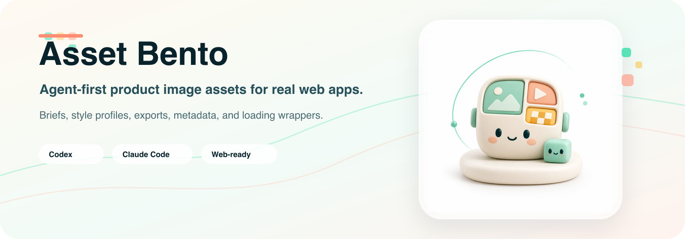

# Asset Bento

<p align="center">
  
</p>

Agent-first product image assets for real web apps.

Asset Bento helps Codex and Claude Code turn product design intent into brand-consistent, production-ready image asset packages: reusable brand/style profiles, structured briefs, generated originals, PNG/WebP exports, metadata, alt text, and optional loading animation wrappers.

It is not just a prompt library. It is a guided workflow for common product UI assets: loading states, empty states, success states, onboarding visuals, feature-card art, and small product icons.

See [release notes](RELEASE_NOTES.md) for what shipped in the latest version.

## Agent-First Demo

Ask your agent:

```text
Help me make a premium but friendly loading asset for TinyNest.
```

The Asset Bento skill guides the session:

1. Find or create a brand profile.
2. Recommend a style preset such as `premium-minimal`, `friendly-clay`, or `soft-glass`.
3. Create a reusable style profile if the direction is custom.
4. Write a structured asset brief.
5. Generate variations through the CLI.
6. Help review, export, package, and optionally create a loading animation wrapper.

## Install

```bash
npm install
cp .env.example .env
```

Set `OPENAI_API_KEY` in `.env` before running real image generation. Tests never call the OpenAI API.
The CLI automatically loads `.env` from the current working directory without overriding shell environment variables.

## Quick Start With The CLI

```bash
npm run dev -- init-brand --name "TinyNest" --out ./examples/tinynest-style/brand-profile.yaml
npm run dev -- brief --brand ./examples/tinynest-style/brand-profile.yaml --type loading --name tn-loading-duo --complexity minimal --out ./examples/tinynest-style/briefs/loading-duo.yaml
npm run dev -- validate --brand ./examples/tinynest-style/brand-profile.yaml --brief ./examples/tinynest-style/briefs/loading-duo.yaml
```

Generate with OpenAI when your API key is configured in `.env`:

```bash
npm run dev -- generate --brief ./examples/tinynest-style/briefs/loading-duo.yaml --variations 4 --out ./outputs/tn-loading-duo
```

Export and package:

```bash
npm run dev -- export --input ./outputs/tn-loading-duo/001/original.png --sizes 128,256,512,1024 --formats png,webp --webp-quality 82 --out ./outputs/tn-loading-duo/001/export --basename tn-loading-duo
npm run dev -- package --asset ./outputs/tn-loading-duo/001 --out ./dist/tn-loading-duo
npm run dev -- animate --input ./outputs/tn-loading-duo/001/original.png --type orbit --name tn-loading-duo --out ./dist/tn-loading-duo/animation
```

After `npm run build`, the CLI binary is `abento`.

## Built-In Style Presets

- `premium-minimal`: polished, restrained SaaS assets with generous whitespace.
- `soft-glass`: translucent glass forms and delicate reflections.
- `friendly-clay`: warm clay-like 3D shapes with approachable personality.
- `clean-saas-3d`: crisp modern 3D for SaaS feature/onboarding surfaces.
- `flat-product-icon`: simple flat icons optimized for small UI sizes.
- `playful-mascot-lite`: light mascot-inspired warmth without cartoon clutter.

## Asset Types

MVP asset types: `empty-state`, `loading`, `success`, `error`, `attention`, `onboarding`, `feature`, `team-icon`, `avatar-placeholder`, `billing`, `communication`, `learning`, and `custom`.

## Design Rules

Asset Bento defaults to restrained product assets: one main visual idea, one or two accents, no text, no logo recreation, white backgrounds, and no fake dashboards unless the brief explicitly allows UI mockups.

Transparency is supported as a brief mode, but the MVP treats white backgrounds as the default. Native transparency is sent to providers only when supported, and white-to-alpha should be considered experimental for glassy or shadow-heavy assets.

## Agent Skills

The canonical skill lives at `skills/asset-bento/SKILL.md`.

Repo-scoped adapters are included for:

- Codex: `.agents/skills/asset-bento/SKILL.md`
- Claude Code: `.claude/skills/asset-bento/SKILL.md`

Both adapters point agents back to the canonical skill so the workflow remains agent-neutral.

Reusable profile folders:

- Brand profiles: `profiles/brand/`
- Style profiles: `profiles/style/`
- Built-in style presets: `presets/styles/`
- Guided session records: `sessions/`

In Codex or Claude Code, open this repository and ask for a product image asset in natural language. The agent should read the repo-scoped skill adapter and guide the workflow.

## Development

```bash
npm test
npm run lint
npm run build
```

No secrets or proprietary brand assets should be committed.
